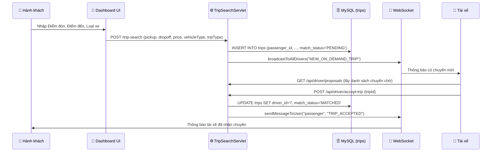
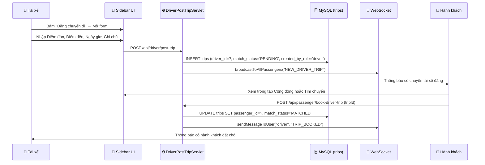

# Tích hợp chức năng "Đăng chuyến đi" cho Tài xế

## Bối cảnh & Phân tích luồng hiện tại

### Luồng hiện tại (Chỉ Hành khách đăng chuyến)



### Vấn đề cốt lõi

Hiện tại, hệ thống **chỉ hoạt động 1 chiều**: Hành khách tạo chuyến → Tài xế nhận chuyến. Nút "Đăng chuyến đi" trên giao diện tài xế (sidebar.jsp, dòng 180-184) **chưa có chức năng** (không có `onclick` hay form nào).

Chức năng mới cần bổ sung: **Tài xế chủ động đăng chuyến đi** để hành khách có thể tìm và đặt xe ngược lại.

---

## Thiết kế chức năng mới

### Concept: "Chuyến đi do Tài xế đăng" (Driver-Posted Trip)

Tài xế đăng chuyến đi từ A → B với thông tin giá cả, loại xe, thời gian khởi hành. Hành khách duyệt danh sách và đặt chỗ.

> [!IMPORTANT]
> **Quyết định thiết kế quan trọng:** Chuyến đi do tài xế đăng sẽ sử dụng bảng `trips` hiện có, nhưng thêm một cột `created_by_role` để phân biệt ai tạo chuyến. Điều này giữ cho hệ thống đơn giản, tận dụng tối đa code hiện tại (WebSocket, Email, Matching...).

### Luồng mới (Tài xế đăng chuyến)



---

## Open Questions

> [!IMPORTANT]
> **Câu hỏi 1: Phạm vi tính năng**
> Bạn muốn triển khai ở mức nào trong giai đoạn đầu?
> - **Mức A (Đơn giản):** Tài xế chỉ đăng chuyến lên Cộng đồng (blog), hành khách liên hệ qua SĐT. Không cần thay đổi Database.
> - **Mức B (Đầy đủ):** Tài xế đăng chuyến → Hành khách bấm "Đặt chỗ" trực tiếp → Hệ thống tự ghép (giống luồng ngược lại). Cần sửa Database + viết Servlet + UI mới.

> [!IMPORTANT]
> **Câu hỏi 2: Giá cước**
> Ai quyết định giá chuyến đi do tài xế đăng?
> - **Phương án 1:** Tài xế tự nhập giá (linh hoạt, nhưng có thể bị "chặt chém").
> - **Phương án 2:** Hệ thống tự tính giá dựa trên khoảng cách (giống hành khách, dùng API VietMap + công thức hiện tại). Tài xế không sửa được.
> - **Phương án 3:** Hệ thống tính giá gợi ý, tài xế được điều chỉnh trong phạm vi ±20%.

> [!IMPORTANT]
> **Câu hỏi 3: Số ghế trống**
> Chuyến tài xế đăng có hỗ trợ nhiều hành khách cùng đi không?
> - **Phương án 1:** 1 hành khách duy nhất (giống luồng hiện tại).
> - **Phương án 2:** Nhiều hành khách (carpooling/đi ghép). Cần thêm bảng DB mới và logic phức tạp hơn.

---

## Proposed Changes (Mức B - Đầy đủ, 1 hành khách)

Dưới đây là phương án chi tiết cho **Mức B** với **1 hành khách / chuyến** và **hệ thống tự tính giá**.

---

### Database

#### [MODIFY] Bảng `trips`

Thêm cột để phân biệt ai tạo chuyến:
```sql
ALTER TABLE trips ADD COLUMN created_by_role ENUM('passenger', 'driver') DEFAULT 'passenger';
```

> [!NOTE]
> Cột này cho phép phân biệt chuyến do hành khách tạo (luồng cũ) và chuyến do tài xế đăng (luồng mới). Mọi logic hiện tại không bị ảnh hưởng vì mặc định là `'passenger'`.

---

### Backend - Java Controller

#### [NEW] [DriverPostTripServlet.java](file:///d:/DevKibo_Project/TransCake_LandingPage/src/main/java/org/example/controller/DriverPostTripServlet.java)

Servlet xử lý tài xế đăng chuyến đi. Tạo bản ghi `trips` với:
- `driver_id` = ID tài xế hiện tại (đã biết trước)
- `passenger_id` = NULL (chờ hành khách đặt)
- `match_status` = `'PENDING'`
- `created_by_role` = `'driver'`
- Tự động tính giá bằng API VietMap (tái sử dụng logic từ `PriceCalculationServlet`)
- Broadcast WebSocket tới tất cả hành khách

#### [NEW] [PassengerBookDriverTripServlet.java](file:///d:/DevKibo_Project/TransCake_LandingPage/src/main/java/org/example/controller/PassengerBookDriverTripServlet.java)

Servlet xử lý hành khách đặt chỗ trên chuyến tài xế đăng:
- Cập nhật `passenger_id` vào bản ghi trip
- Set `match_status` = `'MATCHED'`
- Gửi WebSocket + Email thông báo cho tài xế

#### [NEW] [DriverPostedTripsServlet.java](file:///d:/DevKibo_Project/TransCake_LandingPage/src/main/java/org/example/controller/DriverPostedTripsServlet.java)

API GET trả JSON danh sách chuyến tài xế đã đăng (để hành khách xem):
- Lọc `created_by_role = 'driver'` AND `match_status = 'PENDING'`
- Kèm thông tin tài xế (tên, SĐT, loại xe, biển số, avatar)

---

### Backend - DAO

#### [MODIFY] [TripDAO.java](file:///d:/DevKibo_Project/TransCake_LandingPage/src/main/java/org/example/dao/TripDAO.java)

Bổ sung các method:
- `insertDriverTrip(Trip trip)` - Insert trip với `driver_id`, `passenger_id = NULL`, `created_by_role = 'driver'`
- `getPendingDriverPostedTrips()` - Lấy danh sách chuyến tài xế đăng chưa có khách
- `bookDriverTrip(int tripId, int passengerId)` - Hành khách đặt chỗ
- `getDriverPostedTrip(int driverId)` - Kiểm tra tài xế đã đăng chuyến nào chưa

---

### Backend - Model

#### [MODIFY] [Trip.java](file:///d:/DevKibo_Project/TransCake_LandingPage/src/main/java/org/example/model/Trip.java)

Thêm các field:
- `private String createdByRole;` + getter/setter
- `private String driverName;` + getter/setter (để join hiển thị tên tài xế cho hành khách)
- `private String driverPhone;` + getter/setter
- `private String driverAvatar;` + getter/setter
- `private String vehicleName;` + getter/setter (tên xe)
- `private String licensePlate;` + getter/setter (biển số)

---

### Backend - WebSocket

#### [MODIFY] [TripWebSocketEndpoint.java](file:///d:/DevKibo_Project/TransCake_LandingPage/src/main/java/org/example/websocket/TripWebSocketEndpoint.java)

Thêm method:
- `broadcastToAllPassengers(String action, JsonObject payload)` - Tương tự `broadcastToAllDrivers` nhưng gửi tới key bắt đầu bằng `"passenger:"`

---

### Frontend - UI

#### [MODIFY] [sidebar.jsp](file:///d:/DevKibo_Project/TransCake_LandingPage/src/main/webapp/includes/sidebar.jsp)

1. **Nút "Đăng chuyến đi"** (dòng 180-184): Thêm `onclick="window.openDriverPostTripView()"` để mở form.
2. **STATE 6: DRIVER POST TRIP VIEW**: Thêm khối HTML mới (giống kiến trúc Earnings/History view) chứa form đăng chuyến:
   - Input: Điểm đón, Điểm đến (autocomplete VietMap giống hành khách)
   - Chọn: Ngày + Giờ khởi hành
   - Input: Ghi chú cho hành khách
   - Hiển thị: Giá cước tự động tính
   - Nút: "Đăng chuyến"

3. **Trong Passenger View**: Thêm mục "Chuyến tài xế đăng" hiển thị danh sách chuyến do tài xế chủ động đăng, kèm nút "Đặt chỗ".

#### [MODIFY] [dashboard.jsp](file:///d:/DevKibo_Project/TransCake_LandingPage/src/main/webapp/dashboard.jsp)

Thêm các hàm JavaScript:
- `openDriverPostTripView()` / `closeDriverPostTripView()` - Trượt view
- `handleDriverPostTrip(event)` - Gửi form AJAX tới `/api/driver/post-trip`
- Tái sử dụng autocomplete VietMap hiện có cho form tài xế
- `loadDriverPostedTrips()` - Fetch + render danh sách chuyến tài xế cho hành khách
- `bookDriverTrip(tripId)` - Hành khách bấm đặt chỗ

---

### Database - Điều chỉnh bảng `trips`

> [!WARNING]
> **Thay đổi bảng `trips`:** Do cột `passenger_id` hiện tại có constraint `NOT NULL`, chúng ta cần ALTER để cho phép NULL (vì chuyến tài xế đăng ban đầu chưa có hành khách).

```sql
ALTER TABLE trips MODIFY COLUMN passenger_id int DEFAULT NULL;
ALTER TABLE trips ADD COLUMN created_by_role ENUM('passenger', 'driver') DEFAULT 'passenger';
```

Hoặc nếu không muốn thay đổi constraint `NOT NULL`, có thể dùng giá trị đặc biệt `passenger_id = 0` để đại diện "chưa có hành khách". Tuy nhiên cách này không clean.

---

## Verification Plan

### Automated Tests
```bash
mvn clean compile
```
Đảm bảo toàn bộ code biên dịch thành công.

### Manual Verification
1. Đăng nhập tài khoản tài xế → Bấm "Đăng chuyến đi" → Nhập thông tin → Gửi
2. Đăng nhập tài khoản hành khách → Xem danh sách chuyến tài xế → Bấm "Đặt chỗ"
3. Kiểm tra tài xế nhận được thông báo WebSocket
4. Kiểm tra email được gửi cho cả 2 bên
5. Kiểm tra luồng hoàn thành chuyến vẫn hoạt động bình thường
6. Test trên Mobile (responsive)
